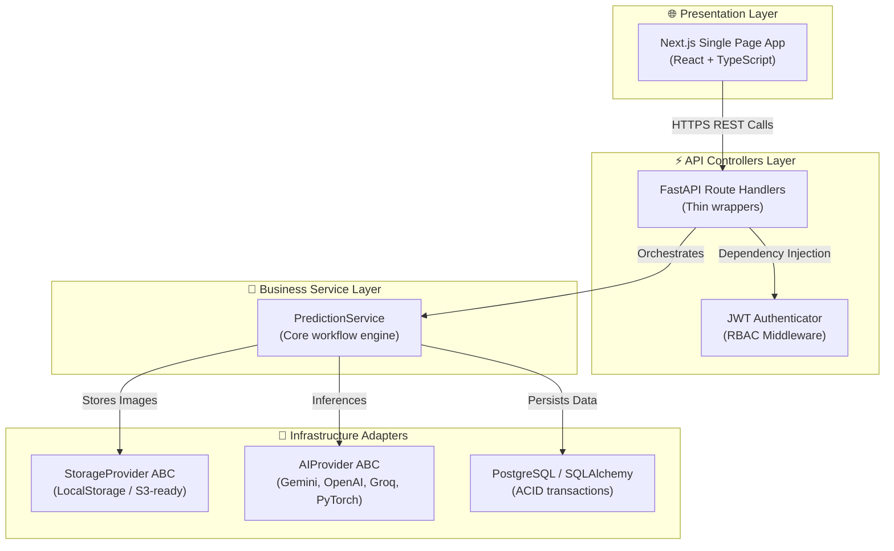

# 🏛️ System Architecture

This document describes the high-level architecture, directory layout, and design patterns utilized in **Krishi Clinic Lite**.

## Core Architectural Patterns

Krishi Clinic Lite is built on a strict **4-Layer Architecture** to enforce separation of concerns, facilitate parallel development, and ensure modularity.

---

## 1. Presentation Layer (Next.js 14)
The frontend utilizes the Next.js App Router. It is divided into:
- **Pages**: Layouts and pages for Home/Feed, History, Analytics, and Predictions Details.
- **Components**: Reusable, atomic UI components (e.g., `UploadForm`, `Navbar`, `Sidebar`, `DiseaseChart`, `VolumeChart`, `HeatmapChart`).
- **Context**: State management for user sessions, language translation context, and theme colors.
- **Client Library**: Axios-configured API wrapper (`api.ts`) managing authorization header interception.

## 2. API Controllers Layer (FastAPI)
FastAPI functions as the REST API layer. Handlers are kept intentionally **thin** (typically $<30$ lines of code). Their only jobs are:
- Validating path, query, and request payload parameters via **Pydantic**.
- Performing authorization checks using FastAPI's dependency injection (`get_current_user`).
- Delegating actual operations to the business service layer.
- Packaging outcomes into JSON response structures.

## 3. Business Service Layer
The core workflow is encapsulated in `PredictionService` (`backend/app/services/prediction_service.py`). It coordinates storage writes, AI model invocations, RAG (Retrieval-Augmented Generation) context injection, and database transactions. Because dependencies are injected via the constructor, this service can be tested offline using mocks.

## 4. Infrastructure Adapters (Abstractions)
External dependencies live behind abstract interfaces (Abstract Base Classes) to decouple the application logic:
- **AIProvider ABC**: Interfaces with AI providers. Concrete classes implement `analyze(image_bytes, crop_type, notes)`.
- **StorageProvider ABC**: Interfaces with storage engines. Concrete classes implement `save(filename, bytes)` and `get_url(filename)`.
- **SQLAlchemy ORM**: Interfaces with PostgreSQL. Operates asynchronously via the `asyncpg` driver.
