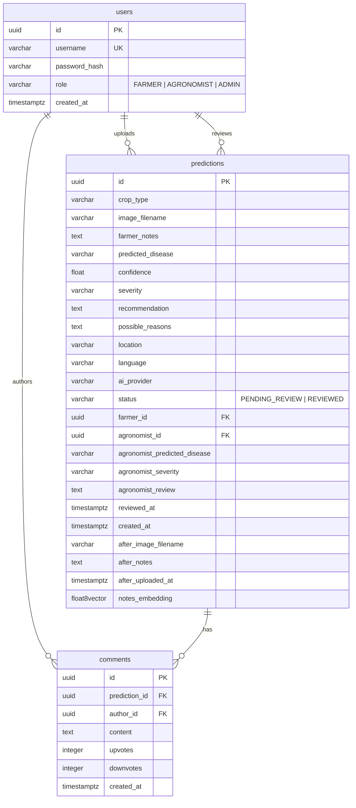

# 💾 Database Schema & Relational Modeling

This document outlines the database schema, indexes, migrations, and seeding strategy implemented in **Krishi Clinic Lite**.

---

## Entity-Relationship Diagram (ERD)

---

## 1. Tables & Columns Details

### `users`
Represents registered users in the platform.
*   `id` (`UUID`): Primary key. Default `gen_random_uuid()`.
*   `username` (`VARCHAR(100)`): Unique username.
*   `password_hash` (`VARCHAR(255)`): Bcrypt-hashed password.
*   `role` (`VARCHAR(50)`): Role-based access level: `FARMER`, `AGRONOMIST`, or `ADMIN`.
*   `created_at` (`TIMESTAMPTZ`): Server timestamp.

### `predictions`
Core analytical data table storing crop observations, AI predictions, expert review data, and follow-up images.
*   `id` (`UUID`): Primary key.
*   `crop_type` (`VARCHAR(100)`): Categorized crop (e.g., Wheat, Rice).
*   `image_filename` (`VARCHAR(255)`): Secure random name (`secrets.token_hex(16)`) stored in filesystem.
*   `farmer_notes` (`TEXT`): Optional description from farmers.
*   `predicted_disease` (`VARCHAR(150)`): Initial diagnosis returned by AI provider.
*   `confidence` (`FLOAT`): AI confidence score ($0.0 - 1.0$).
*   `severity` (`VARCHAR(50)`): Diagnosis severity level (`Low`, `Medium`, `High`).
*   `recommendation` (`TEXT`): Initial treatment advice.
*   `possible_reasons` (`TEXT`): Symptoms triggers or pathogen vectors.
*   `location` (`VARCHAR(150)`): Regional location of observation.
*   `language` (`VARCHAR(10)`): Translation request language.
*   `ai_provider` (`VARCHAR(50)`): AI provider name (e.g., `gemini`, `groq`, `mock`).
*   `status` (`VARCHAR(50)`): Current state: `PENDING_REVIEW` or `REVIEWED`.
*   `farmer_id` (`UUID`): Foreign key referencing `users.id`.
*   `agronomist_id` (`UUID`): Foreign key referencing `users.id` (agronomist who reviewed).
*   `agronomist_predicted_disease` (`VARCHAR(150)`): Verified disease name.
*   `agronomist_severity` (`VARCHAR(50)`): Verified severity.
*   `agronomist_review` (`TEXT`): Expert advice overrides.
*   `reviewed_at` (`TIMESTAMPTZ`): Verification timestamp.
*   `created_at` (`TIMESTAMPTZ`): Row creation timestamp.
*   `after_image_filename` (`VARCHAR(255)`): Follow-up recovery image filename.
*   `after_notes` (`TEXT`): Follow-up farmer notes.
*   `after_uploaded_at` (`TIMESTAMPTZ`): Follow-up upload timestamp.
*   `notes_embedding` (`vector(1536)`): High-dimensional text embedding for RAG mapping.

---

## 2. Performance Indexing

To guarantee efficient lookups and aggregates on the analytical dashboard, indexes are defined on:
*   `idx_predictions_created_at` on `predictions(created_at DESC)` (optimizes chronological list queries and volume tracking charts).
*   `idx_predictions_predicted_disease` on `predictions(predicted_disease)` (optimizes group-by aggregations and filters).
*   `idx_predictions_crop_type` on `predictions(crop_type)` (optimizes crop-specific aggregates).

---

## 3. Database Migrations (Alembic)
Schema versioning is fully handled by Alembic:
*   Configuration: `backend/alembic.ini`
*   Environment script: `backend/app/alembic/env.py` (configured to support async connection pooling via `asyncpg` and autoload metadata).
*   Executing migrations: `alembic upgrade head` (automatically executed inside Docker compose container initialization).
