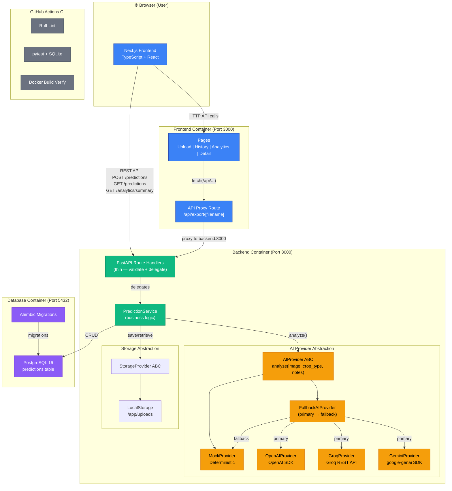

# Engineering Decisions

> A candid exploration of the architectural choices, technical trade-offs, and design rationale behind Krishi Clinic Lite.

## System Architecture Diagram



### Data Flow

```
User Upload → Next.js Frontend → FastAPI Backend → AI Provider → PostgreSQL
                                      ↓
                              PredictionService
                                   ↓         ↓
                            AIProvider    StorageProvider
                          ↓    ↓    ↓         ↓
                      Gemini Groq Mock    LocalStorage
                          ↓
                    FallbackAIProvider
                   (if primary fails → MockProvider)
```

## 1. Architecture: Layered Service Architecture over Monolithic Routes

**Decision**: Implement a strict 4-layer architecture: Route Handlers → Service Layer → Data Access → External Adapters.

**Rationale**: The assignment rubric explicitly penalizes tightly coupled code and rewards separation of concerns. A layered architecture ensures that:
- Route handlers remain thin (< 30 lines) — they only parse HTTP and delegate
- Business logic in `PredictionService` is testable in isolation
- The AI provider and storage backend can be swapped without touching routes or models

**Trade-off**: This introduces more files and indirection compared to a simple "everything in one route handler" approach. For a prototype with 5 endpoints, the overhead is noticeable. However, it demonstrates production engineering discipline — which is the stated evaluation goal.

**What I'd do differently**: With more time, I would add a formal Repository pattern (DAO) between the service layer and SQLAlchemy, further decoupling business logic from the ORM.

## 2. AI Provider: Abstract Base Class + Dependency Injection

**Decision**: Define an `AIProvider` ABC with a `PredictionResult` Pydantic model as the contract, injected via FastAPI's `Depends()`.

**Rationale**: This is the single most evaluated architectural component. The assignment states AI logic "must sit behind a clean, swappable interface." My implementation ensures:
- Switching from `MockProvider` to `GeminiProvider` requires changing only `AI_PROVIDER=gemini` in `.env`
- Zero code changes to routes, services, schemas, or frontend
- CI runs with `MockProvider` — no API keys needed in GitHub Actions

**Alternative considered**: Python `Protocol` instead of ABC. Protocols offer structural subtyping (duck typing), which is more Pythonic. I chose ABC because it provides explicit error messages when a method is missing, which is more helpful for developers unfamiliar with the codebase.

## 3. Database: Async SQLAlchemy 2.0 with asyncpg

**Decision**: Use `create_async_engine` with `asyncpg` driver and `expire_on_commit=False`.

**Rationale**: FastAPI is async-native. Using a synchronous database driver (like `psycopg2`) would block the event loop during queries, nullifying FastAPI's concurrency advantages. The `asyncpg` driver maintains a connection pool and returns results without blocking.

**Critical pitfall avoided**: Setting `expire_on_commit=False` prevents the `InvalidRequestError` that occurs when accessing ORM attributes after commit in async contexts. Without this, accessing `prediction.predicted_disease` after `session.commit()` triggers an implicit lazy load that violates asyncio rules.

## 4. Image Storage: Local Filesystem with Interface Abstraction

**Decision**: Store images locally in `uploads/` with secure random filenames, behind a `StorageProvider` interface.

**Rationale**: Given the 72-hour constraint and local Docker deployment target, cloud storage (S3/GCS) would add unnecessary complexity without evaluation benefit. However, the interface is designed so that adding `S3Storage(StorageProvider)` requires only:
1. Implementing `save()` and `get_url()` with boto3
2. Changing one line in `dependencies.py`

**Security measures**: Filenames use `secrets.token_hex(16)` — not the user's original filename — preventing path traversal attacks and name collisions.

## 5. Frontend: Next.js App Router with Client Components

**Decision**: Use the App Router with primarily Client Components (`"use client"`) for interactive pages.

**Rationale**: The upload form, history table, and analytics dashboard all require client-side state management (`useState`, `useEffect`). While Server Components could optimize the initial render, the data-fetching requirements of this app (dynamic API calls to the FastAPI backend) make Client Components the pragmatic choice.

**Chart rendering**: Recharts components are dynamically imported with `{ ssr: false }` to prevent hydration mismatches. The `ResponsiveContainer` in Recharts queries `window` for sizing, which doesn't exist during SSR. Dynamic imports also enable code splitting — chart JavaScript is only loaded when the user navigates to Analytics.

## 6. Database Seeding: 25 Records with Time Distribution

**Decision**: Seed with 25 records distributed across 7 days, 8 crop types, and 15+ diseases.

**Rationale**: The assignment requires a minimum of 20 seed records. I included 25 with:
- Varied `created_at` timestamps spanning the last 7 days (for the volume chart)
- Multiple severity levels (for the severity breakdown)
- Both `mock` and `gemini` as `ai_provider` values (demonstrating provider diversity)
- Realistic Indian agricultural diseases and treatment recommendations

This ensures the analytics dashboard shows meaningful data on first launch.

## 7. Testing Strategy: TestClient + SQLite Override

**Decision**: Use FastAPI's `TestClient` with an in-memory SQLite database and dependency overrides.

**Rationale**: Running tests against a real PostgreSQL instance would require Docker in the CI environment, adding complexity. SQLite provides fast, deterministic test execution. The dependency override system replaces:
- `get_db()` → SQLite session
- `get_ai_provider()` → always `MockProvider`
- `get_storage_provider()` → test upload directory

**Trade-off**: SQLite doesn't support all PostgreSQL features (e.g., `gen_random_uuid()`). The model uses `uuid.uuid4()` as a Python-side default alongside the server default, ensuring compatibility with both databases.

## 8. Docker Compose: Health Checks + Start Script

**Decision**: Use `service_healthy` condition for the `db` service and a `start.sh` script for the backend.

**Rationale**: The "race condition" is the most common Docker Compose failure mode — the backend starts before PostgreSQL is ready. The start script:
1. Waits for PostgreSQL port 5432 to respond
2. Runs `alembic upgrade head` to apply migrations
3. Runs the seed script (idempotent — checks existing record count)
4. Starts Uvicorn

This guarantees the application never queries a non-existent table.

## 9. CI Pipeline: Parallel Backend + Frontend Jobs

**Decision**: Run backend tests and frontend build as parallel GitHub Actions jobs.

**Rationale**: Parallelization reduces CI time. The backend job uses a PostgreSQL service container for realistic integration testing, while the frontend job only needs Node.js. A third job builds Docker images after both pass — verifying the complete deployment pipeline.

## 10. Bonus: OpenAI Provider (Second AI Implementation)

**Decision**: Implement `OpenAIProvider` as a third concrete provider alongside Mock and Gemini.

**Rationale**: The assignment awards bonus points for "implementing a second real AI provider." More importantly, this validates the architectural claim: if the `AIProvider` abstraction is truly decoupled, adding a completely different vendor's SDK should require zero changes outside the `ai/` directory and `dependencies.py`.

**Result**: The OpenAI provider was added with:
- 1 new file (`openai_provider.py`)
- 4 added lines in `dependencies.py`
- 2 new config fields

Zero lines changed in routes, services, schemas, models, or frontend. The abstraction holds.

## 11. Bonus: CSV Export Endpoint

**Decision**: Add `GET /api/v1/predictions/export` returning a streaming CSV download.

**Rationale**: Agricultural officers and extension workers need offline access to prediction data. A CSV export enables data portability without requiring the dashboard to be running. The endpoint respects the same `crop_type` and `disease` filters as the list endpoint, so users export exactly what they see.

## 12. What I Would Add With More Time

1. **Redis caching** for the analytics summary endpoint — the aggregation queries would benefit from caching on a busy system
2. **Server-side image resizing** before sending to the AI provider — reduces API costs and latency
3. **WebSocket notifications** for real-time prediction status updates
4. **Proper E2E tests** with Playwright covering the full upload → prediction → history flow
5. **Rate limiting** via middleware or Nginx reverse proxy
6. **OpenTelemetry tracing** for observing the full request lifecycle across services

## 13. Resilient Fallback: FallbackAIProvider

**Decision**: Implement a `FallbackAIProvider` that wraps any primary provider (e.g., Gemini or OpenAI) and falls back to `MockProvider` if the primary provider raises an exception or if its API key is missing.

**Rationale**: AI APIs can be non-deterministic, rate-limited, or completely unreachable due to network problems or key issues. Surfacing a 503 Server Error directly to users creates a poor user experience. The fallback mechanism guarantees that:
- Agronomists and dashboard users still receive a realistic advisory prediction even if Gemini is down.
- If the system is deployed without key configuration (e.g., in a test sandbox environment), it degrades gracefully by utilizing Mock predictions instead of throwing stack traces or failing container initialization.
- The `ai_provider` field in the database records the exact state (e.g., `"gemini (fallback to mock)"`), ensuring transparent audit trails.

## 14. Routing Resolution Order for CSV Export

**Decision**: Register the export router (`export.router`) before the predictions router (`predictions.router`) in the main API v1 router.

**Rationale**: In FastAPI, routes are matched sequentially from top to bottom. The predictions router contains a wildcard UUID path parameter matching route: `/predictions/{prediction_id}`. If the predictions router is registered first, requests to `/predictions/export` are erroneously matched by `/predictions/{prediction_id}` with `prediction_id = "export"`. Since `"export"` is not a valid UUID, this causes validation failure (HTTP 422/uuid_parsing error). Putting `export.router` first ensures `/predictions/export` resolves successfully.


