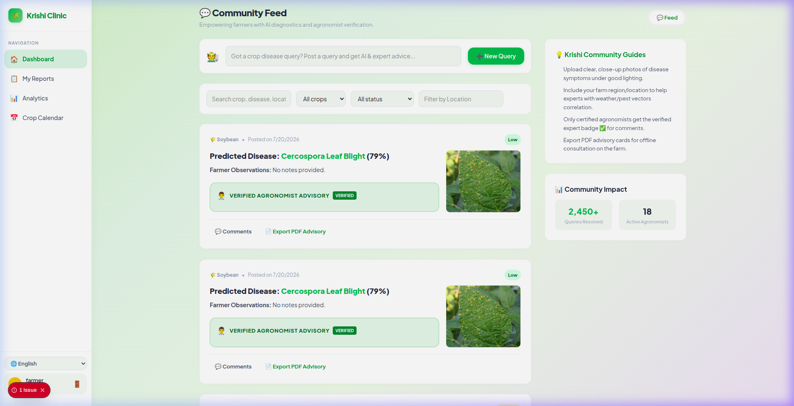
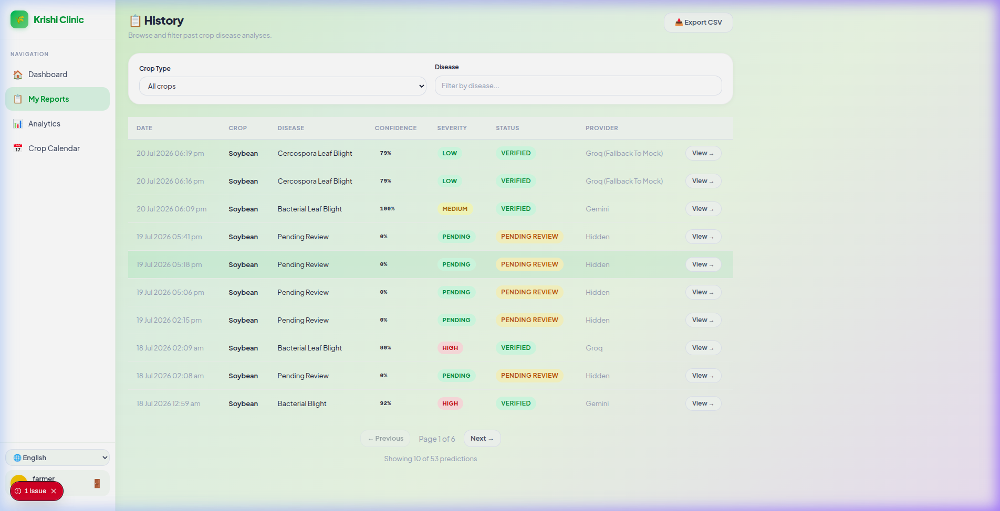
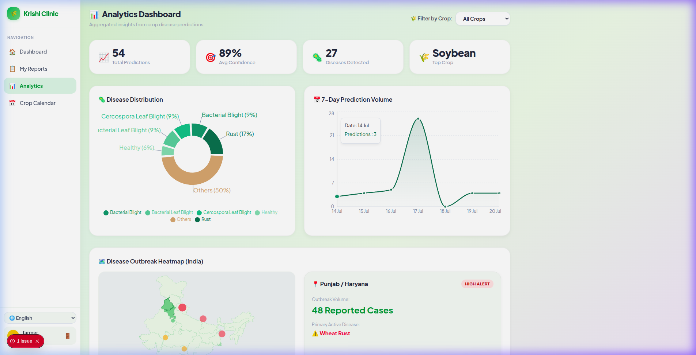
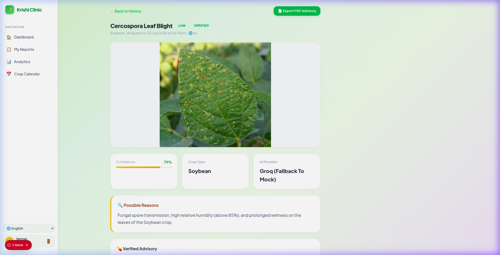

# Krishi Clinic Lite

> AI-powered crop disease diagnosis dashboard — built for India's agricultural intelligence platform.

### 🌐 Live Production Demo: **[frontend-woad-mu-58.vercel.app](https://frontend-woad-mu-58.vercel.app)**
### 📄 Google Docs Product Documentation: **[Google Doc Link](https://docs.google.com/document/d/1QrMX1ZR9vHQMWGVhREGGvfzNoql8NK6Ca_ba4616hmE/edit?tab=t.0#heading=h.z333nsye6gip)**
### 🎥 1-Minute Demo Video: **[YouTube Link](https://www.youtube.com/watch?v=qenq3j1mEhQ)**


## Overview

Krishi Clinic Lite is a streamlined crop disease advisory pipeline that enables farmers and agricultural professionals to upload crop images, receive AI-powered disease predictions, and track agricultural health analytics through an intuitive dashboard.

```
┌─────────────┐      ┌─────────────┐      ┌─────────────┐
│   Frontend  │ ───► │   Backend   │ ───► │  PostgreSQL │
│  (Next.js)  │ ◄─── │  (FastAPI)  │ ◄─── │   (Docker)  │
└─────────────┘      └─────────────┘      └─────────────┘
                            │
                            ▼
                      ┌─────────────┐
                      │ AI Provider │
                      │ (Interface) │
                      └─────────────┘
                            │
          ┌─────────────┬─────────────┬─────────────┬─────────────┐
          ▼             ▼             ▼             ▼             ▼
    ┌───────────┐ ┌───────────┐ ┌───────────┐ ┌───────────┐ ┌───────────┐
    │  Gemini   │ │   Groq    │ │  OpenAI   │ │   Local   │ │   Mock    │
    │ Provider  │ │ Provider  │ │ Provider  │ │  PyTorch  │ │ Provider  │
    └───────────┘ └───────────┘ └───────────┘ └───────────┘ └───────────┘
```

## Tech Stack

| Layer | Technology | Rationale |
|-------|-----------|-----------|
| **Frontend** | Next.js 14 (TypeScript) + Tailwind CSS | App Router, SSR/CSR flexibility, type safety |
| **Backend** | FastAPI (Python 3.12) | Async-first, Pydantic V2 validation, auto OpenAPI docs |
| **Database** | PostgreSQL 15 + SQLAlchemy 2.0 + Alembic | ACID compliance, async via asyncpg, version-controlled migrations |
| **AI** | Gemini / Groq / OpenAI / Local PyTorch / Mock | 5 swappable implementations via ABC + dependency injection |
| **DevOps** | Docker Compose + GitHub Actions | Single-command deployment, automated CI pipeline |
| **Charts** | Recharts | Declarative React charts, SSR-safe via dynamic imports |

## Quick Start

### Prerequisites
- Docker & Docker Compose
- Git

### Setup

```bash
# 1. Clone the repository
git clone https://github.com/YOUR_USERNAME/krishi-clinic-lite.git
cd krishi-clinic-lite

# 2. Configure environment
cp .env.example .env
# Edit .env to set GEMINI_API_KEY or GROQ_API_KEY

# 3. Launch the entire stack
docker compose up --build
```

The application will be available at:
- **Frontend**: http://localhost:3000
- **Backend API**: http://localhost:8000
- **API Documentation**: http://localhost:8000/docs

### Using the Mock AI Provider (Default)

The application ships with `AI_PROVIDER=mock` by default, which requires **no API keys** and returns realistic, deterministic predictions based on crop type. This is ideal for development and evaluation.

### Using Google Gemini

```bash
# In your .env file:
AI_PROVIDER=gemini
GEMINI_API_KEY=your_actual_api_key
```

### Using Groq (Recommended for real AI testing)

```bash
# In your .env file:
AI_PROVIDER=groq
GROQ_API_KEY=your_groq_api_key
```

### Using the Local PyTorch AI Provider (Offline Deep Learning)

```bash
# In your .env file:
AI_PROVIDER=local
```
No API keys are required. The first request will automatically download the fine-tuned EfficientNetV2-S model weights and metadata from the Hugging Face Hub (cached under `backend/app/ai/weights/`). All subsequent predictions run completely offline on CPU/GPU.

### Per-Request Model Override

The frontend features an **AI Model** dropdown selector. This allows you to explicitly route any individual prediction request to **Gemini, Groq, OpenAI, Local PyTorch, or Mock** at runtime, demonstrating the live swappable architecture.

## API Endpoints

| Method | Endpoint | Description |
|--------|----------|-------------|
| `GET` | `/health` | Health check with DB status |
| `POST` | `/api/v1/predictions` | Upload image for disease analysis |
| `GET` | `/api/v1/predictions` | List predictions (paginated, filterable) |
| `GET` | `/api/v1/predictions/{id}` | Get prediction details |
| `GET` | `/api/v1/analytics/summary` | Dashboard analytics data |
| `GET` | `/api/v1/predictions/export` | Download predictions as CSV (Bonus) |

Full interactive documentation at `/docs` (Swagger UI) or `/redoc`.

## AI Provider Abstraction

The most critical architectural decision — AI logic is completely decoupled from API routes:

```python
class AIProvider(ABC):
    @abstractmethod
    async def analyze(self, image: bytes, crop_type: str, ...) -> PredictionResult:
        ...
```

**Switching providers requires zero code changes** — only update the `AI_PROVIDER` environment variable. The service layer and API routes never import or reference any concrete provider.

## Project Structure

```
├── backend/                    # FastAPI application
│   ├── app/
│   │   ├── ai/                 # AI provider abstraction
│   │   │   ├── base.py         # Abstract interface
│   │   │   ├── mock_provider.py
│   │   │   ├── gemini_provider.py
│   │   │   └── openai_provider.py  # Bonus: 2nd real provider
│   │   ├── api/v1/endpoints/   # Thin route handlers
│   │   ├── core/               # Config, DB, DI
│   │   ├── models/             # SQLAlchemy ORM models
│   │   ├── schemas/            # Pydantic request/response
│   │   ├── services/           # Business logic layer
│   │   └── storage/            # File storage abstraction
│   ├── alembic/                # Database migrations
│   └── tests/                  # Pytest suite
├── frontend/                   # Next.js application
│   └── src/
│       ├── app/                # App Router pages
│       ├── components/         # Reusable UI components
│       └── lib/                # API client, types
├── docker-compose.yml          # Single-command deployment
└── .github/workflows/ci.yml   # CI pipeline
```

## Database Schema

The `predictions` table uses UUID primary keys, timezone-aware timestamps, and strategic indexes:

| Column | Type | Description |
|--------|------|-------------|
| `id` | UUID (PK) | `gen_random_uuid()` — prevents enumeration |
| `crop_type` | VARCHAR(100) | Crop classification |
| `image_filename` | VARCHAR(255) | Secure random filename |
| `farmer_notes` | TEXT | Optional observations |
| `predicted_disease` | VARCHAR(150) | AI diagnosis |
| `confidence` | FLOAT | 0.0–1.0 score |
| `severity` | VARCHAR(50) | Low / Medium / High |
| `recommendation` | TEXT | Treatment advice |
| `ai_provider` | VARCHAR(50) | Provider identifier |
| `created_at` | TIMESTAMPTZ | Timezone-aware timestamp |

Indexes on `created_at`, `predicted_disease`, and `crop_type` for analytics performance.

## Testing

```bash
# Run backend tests
cd backend && pytest tests/ -v

# Tests cover:
# - Health endpoint verification
# - Prediction CRUD operations
# - File validation (invalid types, empty files)
# - AI provider abstraction (MockProvider)
# - Analytics aggregation
```

## Development

```bash
# Backend only (with hot reload)
cd backend
pip install -r requirements.txt
uvicorn app.main:app --reload

# Frontend only (with hot reload)
cd frontend
npm install
npm run dev
```

## Key Product Engineering Features

### 🔐 JWT Authentication & Expert Review Workflow
We implemented a complete role-based workflow:
* **Roles:** `FARMER`, `AGRONOMIST`, `ADMIN` (passwords hashed using `bcrypt` in the DB).
* **Expert Review Masking:** Standard crop uploads from farmers go into the `PENDING_REVIEW` state. The API masks raw AI predicted disease and confidence levels with localized "Pending expert review" messages for farmers.
* **Agronomist Portal:** Agronomists can log in (username: `agronomist`, password: `password123`) to view raw AI predictions and confidence scores, verify the crop disease, customize advisory notes, and confirm the diagnosis. Once verified, the status becomes `REVIEWED` and the final verified advice is unlocked for the farmer.

### 🗺️ Interactive State-Level India Heatmap
* Overhauled the simple vector outline with a precise, interactive vector map of India's states utilizing the `@svg-maps/india` package.
* When clicking on active disease outbreak indicators, the corresponding Indian states (e.g., Punjab, Maharashtra, Andhra/Telangana) dynamically highlight in green using smooth CSS transitions.

## Known Limitations & Future Improvements

- **Image Storage**: Currently uses local filesystem storage. The `StorageProvider` abstract class is fully defined and ready to support S3/GCS.
- **Caching**: The analytics summary endpoint queries PostgreSQL directly; in a high-traffic environment, caching aggregations in Redis would be implemented.
- **Image Processing**: Large images are passed directly to PyTorch/AI APIs; adding server-side image resizing and compression would improve latency.

## Screenshots

Here are screenshots of the dashboard in action:

#### 💬 Community Feed (Main Dashboard)


#### 📋 Prediction History (Search & Filters)


#### 📊 Analytics Dashboard (Dynamic Charts & Vector Heatmap)


#### 🔬 Prediction Detail (Advisories & Recovery logs)


## License

This project was built as a technical assignment for GramIQ's Product Engineering Internship.
